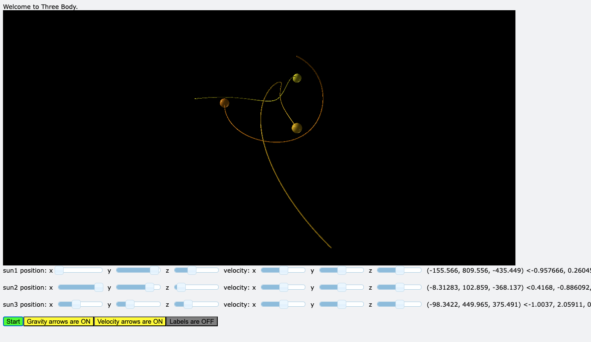

# threebody

Inspired by Cixin Liu's Remembrance of Earth's Past series. This 3d simulation will launch in a browser.

## VPython controls
- mouse scroll wheel to zoom in/out
- Ctrl + left click and drag to pan
- click "random" button on the right of each star control panel, to randomize the initial position and velocity
- click "GO" button to start simulation

It currently only supports 3 suns in GUI, and mass would need to be changed in the code.
Most simulations end very quickly with stars colliding or diverging to infinity. There are some known stable configurations -- implementing some is a TODO.

